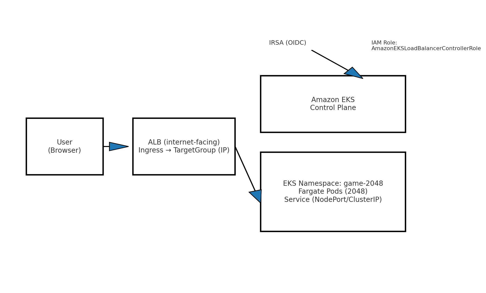
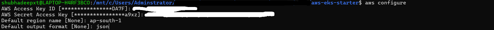
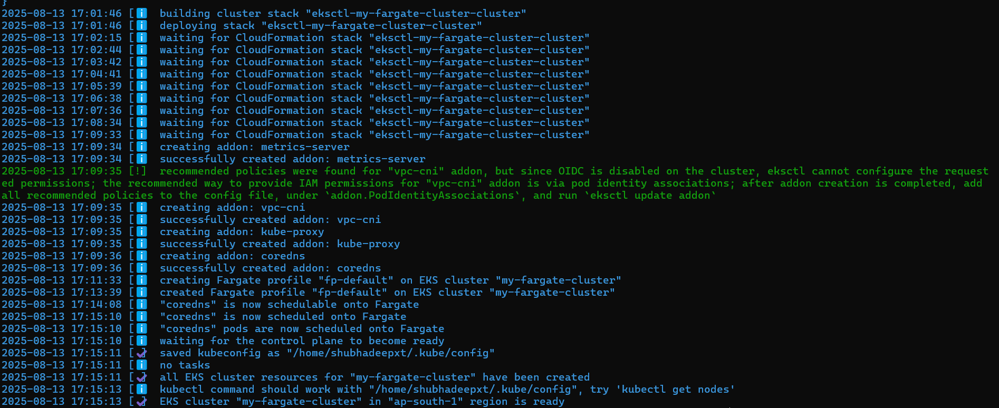
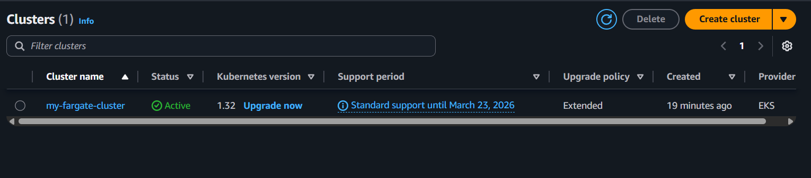
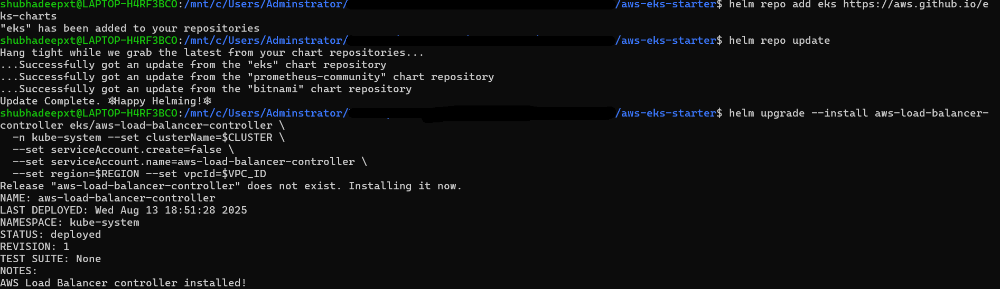
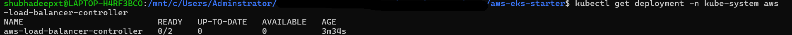
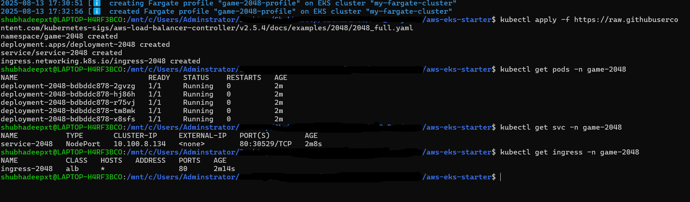
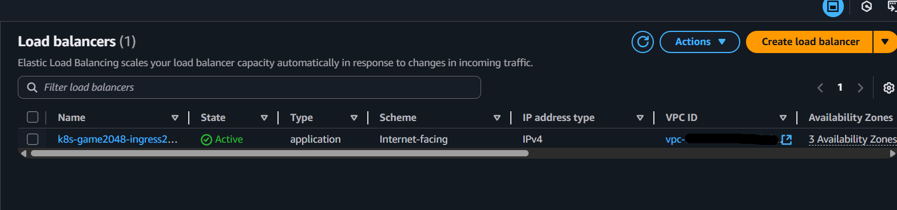
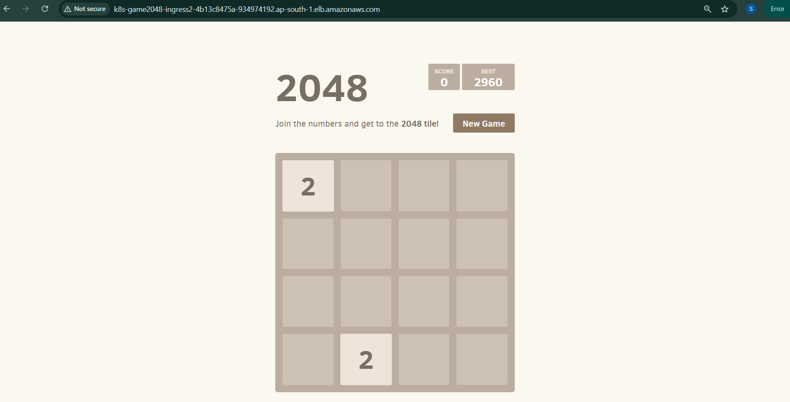

# AWS EKS – 2048 on Fargate with ALB

A minimal, cost‑aware deployment of the 2048 game to **Amazon EKS** (Fargate) exposed via **AWS Application Load Balancer** (ALB) using the **AWS Load Balancer Controller**.

---

### 📐 Architecture Diagram
 
*High-level architecture showing AWS EKS Fargate with ALB routing traffic to the 2048 game pods.*

---

## 📦 Stack

- EKS (managed control plane) • Fargate (serverless data plane)
- AWS Load Balancer Controller (IngressClass `alb`)
- Kubernetes: Deployment, Service, Ingress
- Region: `ap-south-1` • Sample namespace: `game-2048`

---

## 🖼️ Screenshots


### AWS CLI & Cluster Setup
 
*AWS CLI configured with access keys.*

 
*EKS Fargate cluster creation logs.*

 
*Cluster active in AWS console.*

 
*Namespace created for the game.*

---

### Helm & Controller Setup
 
*AWS Load Balancer Controller installed using Helm.*

 
*Example of ALB creation issue during troubleshooting.*

---

### Application Deployment
 
*Applied Kubernetes manifests and checked pods, services, and ingress.*

 
*ALB created in AWS console.*

 
*2048 game running successfully through ALB DNS.*

---

## 🚀 Quick Start

```
# 0) Configure CLI
aws configure
aws eks update-kubeconfig --name my-fargate-cluster --region ap-south-1

# 1) (Optional) Create Fargate profile for app namespace
./scripts/01_fargate_profile.sh

# 2) IRSA / OIDC association + trust policy
./scripts/02_irsa_oidc.sh

# 3) Install AWS Load Balancer Controller (Helm)
./scripts/03_alb_controller.sh

# 4) Deploy app
kubectl apply -k k8s/game-2048
kubectl get ingress -n game-2048 -w
```

Open the Ingress ADDRESS (an *.elb.amazonaws.com host) in your browser.

---

## 🛠 Troubleshooting Guides

- [ALB Not Created](troubleshooting/alb-not-created.md) – Fix missing ALB after deploying Ingress.
- [OIDC Mismatch](troubleshooting/oidc-mismatch.md) – Resolve OIDC provider ID mismatches in IAM trust policy.
- [STS AccessDenied](troubleshooting/sts-accessdenied.md) – Handle `sts:AssumeRoleWithWebIdentity` permission errors.

---

## Cleanup
```
kubectl delete -k k8s/game-2048
helm -n kube-system uninstall aws-load-balancer-controller || true
eksctl delete cluster --name my-fargate-cluster --region ap-south-1
```
---

## 💸 Cost Notes

- Fargate bills per vCPU/memory second while pods run.
- ALB bills hourly + LCU; delete Ingress/ALB after demo.
- Verify no stray EBS volumes, Elastic IPs, NAT GWs.

---
## 📚 Documentation & References

- [**Project Prerequisites**](docs/prerequisites.md) – Required tools, AWS setup, and environment configuration.
- [**Cost Considerations**](docs/cost-considerations.md) – AWS services used, cost breakdown, and optimization tips.

---

## 📂 Key Configuration Files
- [Deployment YAML](configs/deployment.yaml)
- [Service YAML](configs/service.yaml)
- [Ingress YAML](configs/ingress.yaml)
- [Namespace YAML](configs/namespace.yaml)
- [Fargate Profile JSON](configs/fargate-profile.json)
- [Trust Policy JSON](trust.json)

---

## ⚙️ Automation Scripts
- [Create Fargate Profile](scripts/01_fargate_profile.sh)
- [Setup OIDC + IRSA](scripts/02_irsa_oidc.sh)
- [Install ALB Controller](scripts/03_alb_controller.sh)

---

## 📦 Credits

- This project is inspired by Abhishek Veeramalla's AWS Zero to Hero course. 
- Excellent way of explanation and learned a lot from him.
- Youtube link - https://www.youtube.com/watch?v=RRCrY12VY_s&list=PLdpzxOOAlwvLNOxX0RfndiYSt1Le9azze&index=24
- GitHub Repo Link - https://github.com/iam-veeramalla/aws-devops-zero-to-hero/tree/main/day-22

---
