# 🚀 Implementation (AWS Console / UI)

This guide reproduces the project exactly as we did it on the AWS Console:
- VPC with public + private subnets across **2 AZs**
- **NAT Gateway** (per AZ) for secure egress from private subnets
- **Auto Scaling Group** (2 Ubuntu EC2s) in **private** subnets
- **Bastion host** in a **public** subnet for SSH
- **Target Group** (port **8000**) + **Application Load Balancer** (listener **HTTP:8000**)
- App served by **Python `http.server`** with different content on each EC2 → refresh shows alternation

> Terraform automation will be added later in a separate folder. This document is **UI-only**.

---

## ✅ Prerequisites
- AWS account + Console access
- SSH key pair (`.pem`)
- Basic familiarity with EC2, VPC, SGs, ALB, ASG

---

## 1) Create VPC (with “VPC and more”)

1. **VPC → Create VPC → VPC and more**
   - Name: `AWS Prod Example` (or your prefix)
   - IPv4 CIDR: `10.0.0.0/16` (default OK)
   - **AZs:** `2`
   - **Public subnets:** `2` (e.g., `10.0.10.0/24`, `10.0.11.0/24`)
   - **Private subnets:** `2` (e.g., `10.0.20.0/24`, `10.0.21.0/24`)
   - **NAT Gateways:** **One per AZ**
   - **VPC Endpoints:** **None** (remove S3 endpoint if the wizard adds it)
2. Confirm:
   - Public route table → `0.0.0.0/0` via **IGW**
   - Private route tables → `0.0.0.0/0` via **NAT Gateway(s)**

📸 
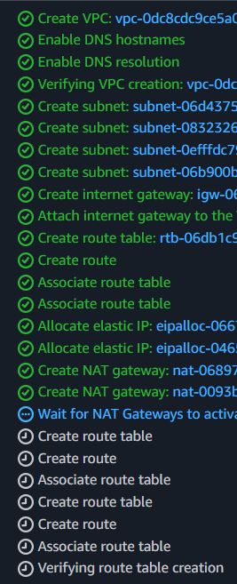 
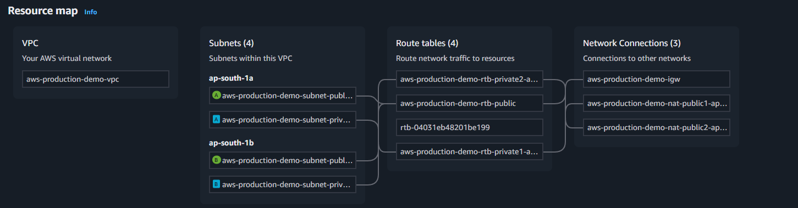 

---

## 2) Security Groups

Create three SGs in this VPC:

- **SG-alb** (for ALB)
  - Inbound: **TCP 8000** from `0.0.0.0/0`
  - Outbound: All
- **SG-bastion**
  - Inbound: **SSH 22** from **My IP**
  - Outbound: All
- **SG-private** (for private EC2s)
  - Inbound: **TCP 8000** from **SG-alb**
  - Inbound: **SSH 22** from **SG-bastion**
  - Outbound: All

📸 


---

## 3) Launch Template (for private EC2s)

**EC2 → Launch Templates → Create**
- AMI: **Ubuntu 24.04** (or Ubuntu LTS)
- Type: `t2.micro`
- Key pair: your `.pem`
- SG: **SG-private**
- **Do not** lock subnet here (ASG sets it)

📸 
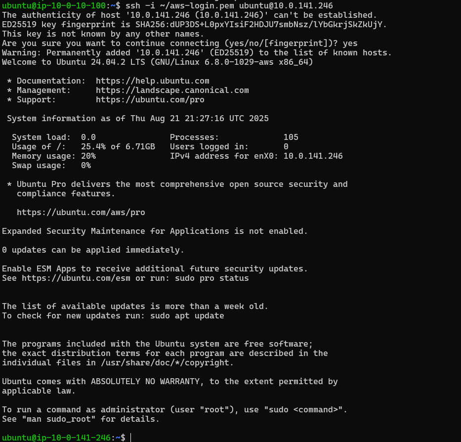

---

## 4) Auto Scaling Group (ASG)

**EC2 → Auto Scaling Groups → Create**
- Name: `AWS Prod Example ASG`
- Launch template: select the one above
- VPC: your VPC
- **Subnets:** **private** subnets in both AZs
- Load balancing: **No load balancer** (attach TG/ALB later)
- Capacity: **Desired=2, Min=2, Max=3–4**
- Create ASG → verify **2 instances** running in **private** subnets (no public IPs)

📸 
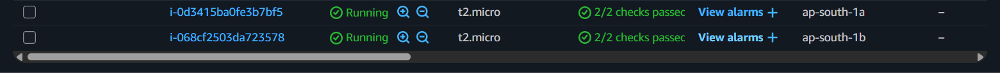  

---

## 5) Bastion Host (Public Subnet)

**EC2 → Launch instances**
- Name: `bastion`
- AMI: Ubuntu 24.04
- Type: `t2.micro`
- Subnet: **public subnet**
- **Auto-assign Public IP: Enabled**
- SG: **SG-bastion**
- Launch and wait for **running** state

📸 
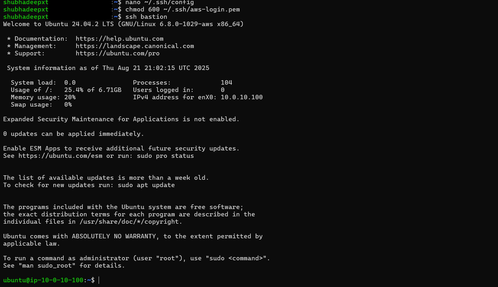
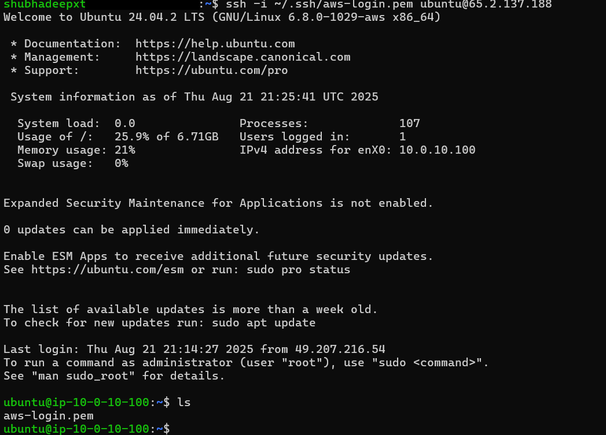

---

## 6) Copy PEM to Bastion & SSH to private EC2s (Trainer method)

On your **laptop/WSL** (adjust paths & IPs):

```
# copy key to bastion
scp -i ~/.ssh/aws-login.pem ~/.ssh/aws-login.pem ubuntu@<BASTION_PUBLIC_IP>:/home/ubuntu/

# login to bastion
ssh -i ~/.ssh/aws-login.pem ubuntu@<BASTION_PUBLIC_IP>
chmod 600 ~/aws-login.pem

# From bastion → private EC2s (user = ubuntu on Ubuntu AMIs):

ssh -i ~/aws-login.pem ubuntu@10.0.20.100
ssh -i ~/aws-login.pem ubuntu@10.0.21.100
```

📸


**Alternative (no key copy) is in docs/SSH_METHODS.md (ProxyJump), but we followed the trainer’s approach here.**
---

## 7) Deploy the app on both private EC2s (port 8000)

On each private EC2:

cd ~
printf '<h4>Instance A ✅</h4><p>Private EC2 A on :8000</p>' > index.html    # (A)
#### For the second instance, change text to Instance B
#### printf '<h4>Instance B ✅</h4><p>Private EC2 B on :8000</p>' > index.html

#### start simple web server
python3 -m http.server 8000
#### If "Address already in use", find & kill:
#### lsof -i:8000 ; kill -9 <PID>

---

## 8) Target Group (Instances • port 8000)

- EC2 → Target Groups → Create
- Target type: Instances
- Protocol: HTTP, Port: 8000
- VPC: your VPC
- Health check path: /index.html (recommended)
- Register both private EC2s

📸
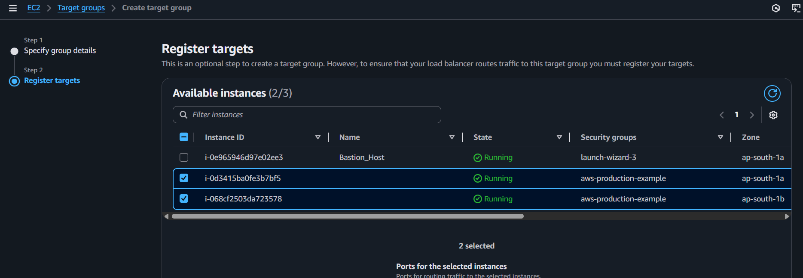

---

## 9) Application Load Balancer (listener HTTP:8000)
- EC2 → Load Balancers → Create → Application Load Balancer
- Scheme: Internet-facing
- Subnets: both public subnets (2 AZs)
- SG: SG-alb
- Listener: Protocol HTTP, Port 8000
- Default action: forward to your Target Group (8000)
- Wait until ALB = Active.

📸
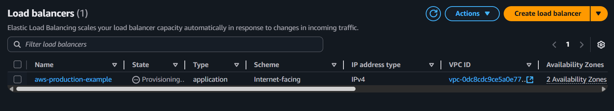

**If you prefer port 80, you can create a listener on 80 and forward to TG:8000; we used 8000 → 8000 to match the demo and screenshots.**

---
## 10) Verify Application

- Copy the **ALB DNS name** and open:http://<ALB-DNS>:8000

- Refresh → responses alternate between **Instance A** and **Instance B**. 
- If one instance is unhealthy:
- Ensure `/index.html` is served on port **8000**.
- Security Group (private) must allow 8000 **from SG-alb**.
- Health check path = `/index.html`.
- On instance, verify:
  ```bash
  curl http://localhost:8000/index.html
  ```
📸
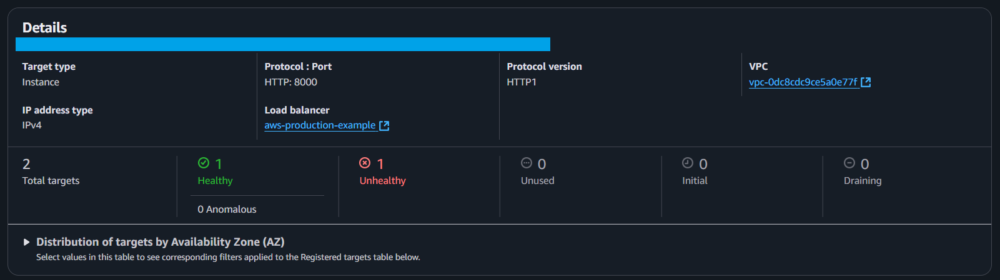
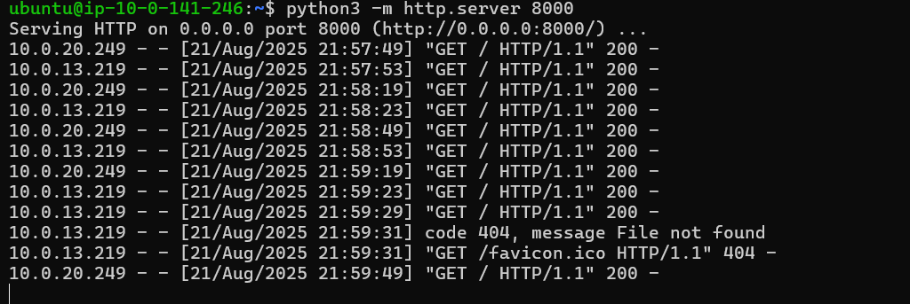
---

## 11) (Optional) Attach ASG ↔ Target Group

- For auto-registration of ASG instances:
- Go to **ASG → Edit → Attach Target Group**.
- Keep `Desired = 2` for demo.

---

## 12) Troubleshooting Quick Refs

- **Key permission error** (scp/ssh): 
```
chmod 600 ~/aws-login.pem
```

# Port 8000 busy:
lsof -i:8000
kill -9 <PID>

# Targets unhealthy:
- Correct health path (/index.html)
- SG rules permit 8000
- App running on 0.0.0.0:8000

📸
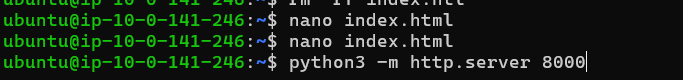

# Instances keep re-creating:
- Set ASG Desired/Min/Max = 0
- Delete ASG → terminate instances

# Cleanup order:
ALB → Target Groups → EC2 → NAT → EIP → IGW → Route Tables → NACLs → Subnets → VPC


---

## 13) Final Demo

- Both instances healthy in Target Group
- ALB listener → HTTP:8000
- Browser refresh alternates between Instance A & B

📸
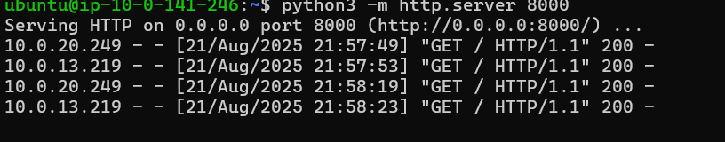
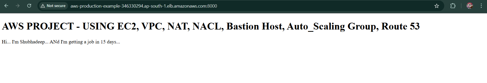

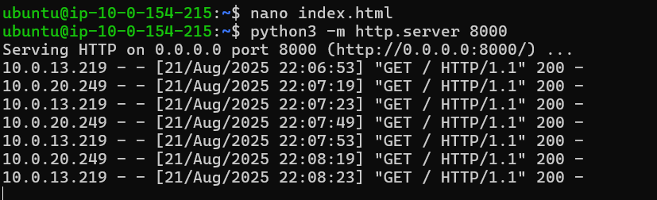
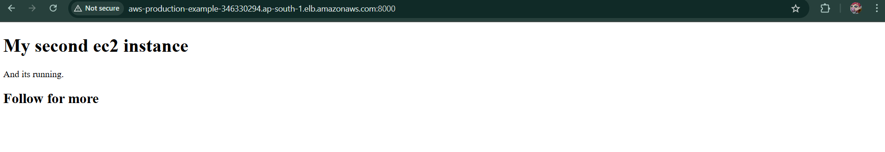

---

## Appendix – Useful Commands

- From laptop → Bastion:
```
scp -i ~/.ssh/aws-login.pem ~/.ssh/aws-login.pem ubuntu@<BASTION_PUBLIC_IP>:/home/ubuntu/
ssh -i ~/.ssh/aws-login.pem ubuntu@<BASTION_PUBLIC_IP>
```

From Bastion → Private Instance:
```
ssh -i ~/aws-login.pem ubuntu@<PRIVATE_IP>
```

On instance: run server
```
python3 -m http.server 8000
```
