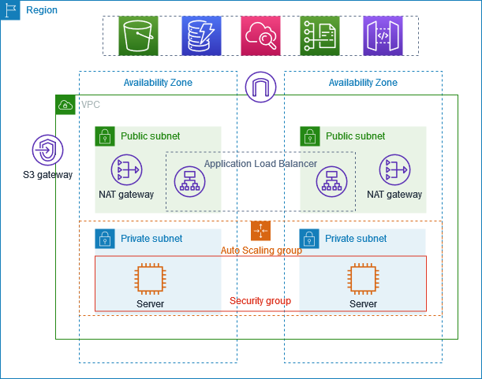

# 📖 Project Overview

## 🎯 Goal
To deploy a **secure, highly available, and scalable application** inside AWS using best practices:
- Applications live in **private subnets** (no direct internet access).
- Access for users comes via an **Internet-facing Application Load Balancer**.
- Secure outbound internet access for private instances is enabled through **NAT Gateways**.
- **Bastion Host** provides controlled SSH access into private EC2s.
- **Auto Scaling Group (ASG)** ensures resiliency and scaling.

This mirrors a **production-grade enterprise setup** and matches AWS’s recommended reference architecture.

---

## 🏗️ Core Architecture

The project spans across **two Availability Zones (AZs)** for high availability. 
If one AZ fails, the other continues serving traffic.

### 🔹 VPC
- Foundation network with a **CIDR block (10.0.0.0/16)**.
- Divided into **public and private subnets** across 2 AZs.

### 🔹 Public Subnets
- Contain: **Load Balancer, NAT Gateway, Bastion Host**.
- Route traffic to the internet via **Internet Gateway**.

### 🔹 Private Subnets
- Contain: **Application EC2s** managed by ASG.
- No direct internet access.
- Outbound access via NAT Gateway.

### 🔹 Internet Gateway
- Connects the VPC to the internet.
- Required for ALB, Bastion, and NAT egress.

### 🔹 NAT Gateway
- One per AZ, each with an **Elastic IP**.
- Allows private EC2s to reach the internet (e.g., updates, APIs).
- Blocks unsolicited inbound traffic.

### 🔹 Auto Scaling Group (ASG)
- Deploys and manages EC2s in private subnets.
- Ensures a minimum of 2 instances are always running (multi-AZ).
- Can scale up/down based on demand.

### 🔹 Application Load Balancer (ALB)
- Deployed in **public subnets**.
- Listener on **HTTP:8000** (demo setup).
- Forwards traffic to Target Group (private EC2s).
- Performs health checks → only routes to **healthy** instances.

### 🔹 Bastion Host
- EC2 in a **public subnet** with a public IP.
- SSH entry point to reach private EC2s.
- Key (.pem) is securely copied to bastion for connecting inside the VPC.

### 🔹 Security Groups
- **SG-bastion:** Allows SSH (22) from admin’s IP.
- **SG-alb:** Allows HTTP (8000) from anywhere.
- **SG-private:** Allows
  - HTTP (8000) only from ALB SG.
  - SSH (22) only from Bastion SG.

---

## 🛠️ Workflow

1. User → ALB DNS (`http://<alb-dns>:8000`) 
2. ALB → Forwards request to healthy targets in **Target Group** 
3. Target Group → Private EC2 (port 8000, running `http.server`) 
4. Admin → SSH into Bastion → SSH into Private EC2 (for updates/configs) 
5. Private EC2s → Outbound internet via NAT Gateway (Elastic IP attached)

---

## ✅ Final Demo Behavior

- Both private EC2s run different `index.html` files on **port 8000**. 
- ALB alternates responses → browser refresh shows Instance A and Instance B outputs. 
- If one instance is down or misconfigured, ALB health checks remove it until it recovers.

---

## 📸 Visual Aids
- [Mind Map](../diagrams/mindmap.png) 
- Step-by-step setup: see [IMPLEMENTATION.md](IMPLEMENTATION.md) 
- Troubleshooting notes: see [CHALLENGES_FACED.md](CHALLENGES_FACED.md)

---

## 🙏 Credits
- **Abhishek Veeramalla** – Source inspiration & trainer guidance: 
  - [YouTube Channel](https://youtu.be/FZPTL_kNvXc?si=W5Vki24fvsUWhERW)
  - [GitHub Repo](https://github.com/iam-veeramalla/aws-devops-zero-to-hero)
- AWS Documentation
- Linux / Python Basics
